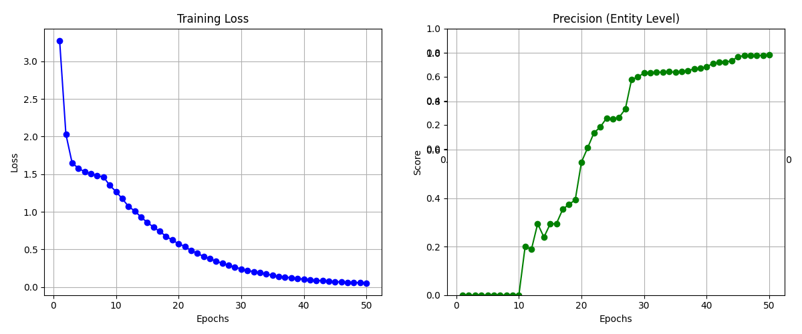
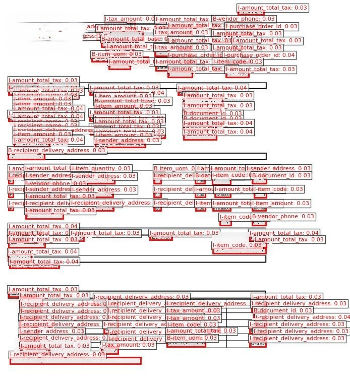
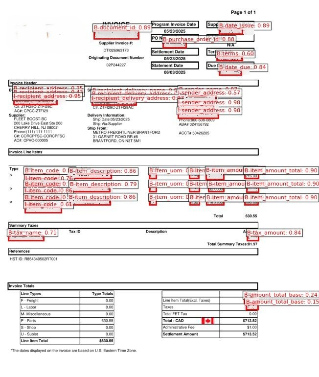
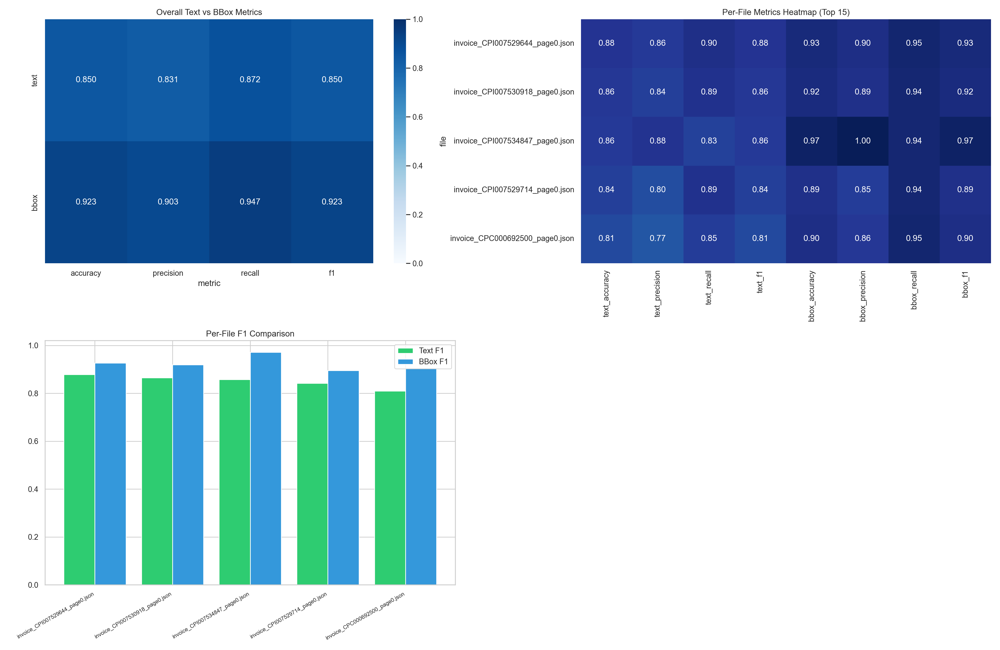

# Fine-tuning Summary

## Model to Finetune
- `microsoft/layoutlmv3-base`

## Input
- **Images**: invoice document page images
- **OCR & Bounding Boxes**: text tokens with 0-1000 normalized bounding box coordinates
- **Labels**: token-level NER tags mapped via `label_config.json` (49 field classes)

## Data Format
- **Input format**: multimodal encoding tuple `(input_ids, attention_mask, bbox, pixel_values, labels)`
- **Target format**: sequence classification tags for token-level invoice field extraction

## Training Parameters
- **Epochs**: `50`
- **Batch size**: `8`
- **Gradient accumulation**: `2`
- **Effective batch size**: `16`
- **Learning rate**: `5e-5`
- **Max sequence length**: `512`
- **Optimizer**: `AdamW`

## Step
1. Load OCR tokens, normalized 0-1000 bounding box coordinates, and label mapping configuration (`label_config.json`).
2. Load pretrained `microsoft/layoutlmv3-base` model with `LayoutLMv3ForTokenClassification`.
3. Initialize `LayoutLMv3Processor` (image processor + tokenizer fast).
4. Pass multimodal page images, words, bounding boxes, and label IDs into PyTorch DataLoader.
5. Train model using custom PyTorch training loop (`train_fn`) with gradient accumulation.
6. Evaluate token precision, recall, and F1 score using `seqeval` (`eval_fn`).
7. Save best checkpoint model (`model.bin`).
8. Save metrics plot (`metrics_plot.png`).

## Training Method
- **Framework**: PyTorch & Hugging Face `transformers`
- **Trainer**: Custom PyTorch training loop (`ModelModule` + `train_fn`/`eval_fn`)
- **Architecture**: `LayoutLMv3ForTokenClassification`

## Expected Result
- A fine-tuned multimodal transformer specialized for **token-level document layout extraction**.
- Extraction quality for:
  - header and identity fields
  - invoice totals and amounts
  - line item tokens
  - normalized 2D layout spatial boxes

## Resource Consumption
- **GPU**: NVIDIA GPU
- **Memory optimization**:
  - `gradient accumulation (steps=2)`
  - `max sequence length 512`
- **Expected usage**:
  - moderate GPU VRAM consumption
  - fast token-level inference processing

## 🖼️ Visualizations & Empirical Results

### Training Metrics

### Inference Comparison (Base vs. Fine-Tuned Model)

  
  

### Evaluation Metrics

