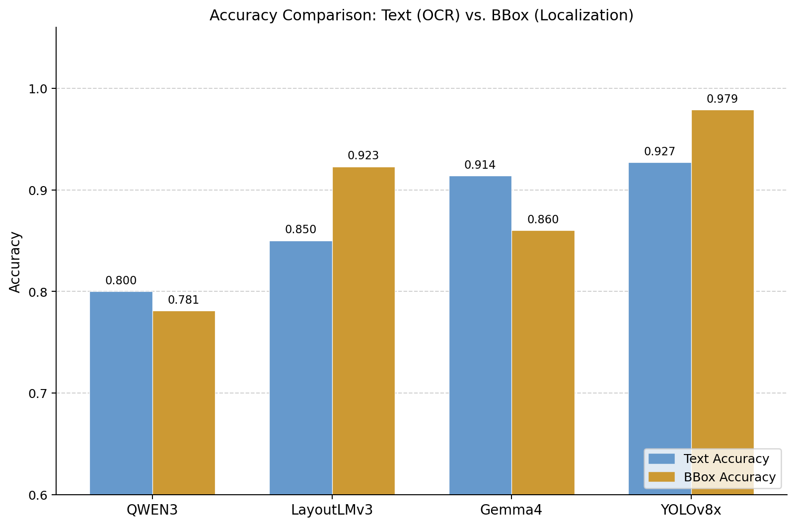
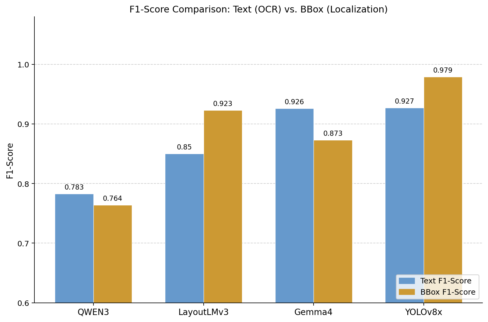

# Bachelor Thesis: Invoice KILE & Localization Comparison Benchmark

This repository contains the empirical benchmark evaluation and comparison across four core model architectures for **Invoice Key Information Extraction (KILE)** and **Bounding Box (BBox) Localization**:

1. **Gemma4-E4B** (`google/gemma-4-E4B-it`) – Fine-tuned Vision-Language Model via Unsloth 4-bit LoRA
2. **Qwen3-VL** (`Qwen/Qwen3-VL-8B-Instruct`) – Fine-tuned Vision-Language Model via Unsloth 4-bit LoRA
3. **LayoutLMv3** (`microsoft/layoutlmv3-base`) – Multimodal Document Transformer for Token Classification
4. **YOLOv8x** (`yolov8x.pt`) – High-resolution Object Detection model for region localization

---

## 📊 Benchmark Results

<p float="left">
  
  
</p>

---

## 📈 Comparison Table

<table>
  <thead>
    <tr>
      <th rowspan="2">Metric / Model</th>
      <th colspan="2" align="center">Accuracy</th>
      <th colspan="2" align="center">F1-Score</th>
    </tr>
    <tr>
      <th align="center">Text</th>
      <th align="center">Bounding Box</th>
      <th align="center">Text</th>
      <th align="center">Bounding Box</th>
    </tr>
  </thead>
  <tbody>
    <tr>
      <td><strong>YOLOv8x</strong></td>
      <td align="center">0.927</td>
      <td align="center">0.979</td>
      <td align="center">0.927</td>
      <td align="center">0.979</td>
    </tr>
    <tr>
      <td><strong>LayoutLMv3</strong></td>
      <td align="center">0.850</td>
      <td align="center">0.923</td>
      <td align="center">0.850</td>
      <td align="center">0.923</td>
    </tr>
    <tr>
      <td><strong>Qwen3-VL</strong></td>
      <td align="center">0.800</td>
      <td align="center">0.781</td>
      <td align="center">0.783</td>
      <td align="center">0.764</td>
    </tr>
    <tr>
      <td><strong>Gemma4-E4B</strong></td>
      <td align="center">0.914</td>
      <td align="center">0.860</td>
      <td align="center">0.926</td>
      <td align="center">0.873</td>
    </tr>
  </tbody>
</table>

---

## 📂 Repository Structure

```text
BachelorThesis_ComparisonBenchmark/
├── ComparisonBenchmark/            # Comparative visualization charts
│   ├── accuracy-compare.png
│   └── f1-compare.png
├── Gemma4-E4B/                      # Fine-tuning & inference pipeline for Gemma4-E4B
│   ├── README.md
│   ├── gemma4-ft.py
│   └── gemma4-inference.ipynb
├── Qwen3-VL/                        # Fine-tuning & inference pipeline for Qwen3-VL
│   ├── README.md
│   ├── qwen3-ft.py
│   └── qwen3-inference.ipynb
├── LayoutLMv3/                      # Multimodal token classification pipeline
│   ├── README.md
│   ├── layoutlmv3-ft.py
│   ├── layoutlmv3-inference.ipynb
│   └── src/
└── YOLOv8x/                         # High-resolution object detection pipeline
    ├── README.md
    ├── yolov8x-ft.py
    ├── yolov8x-inference.ipynb
    └── yolov8 fine-tuning/
```
